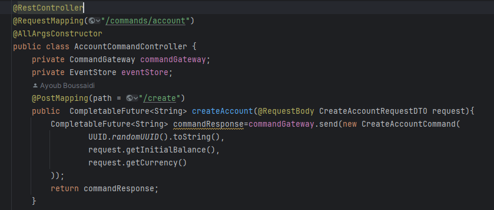
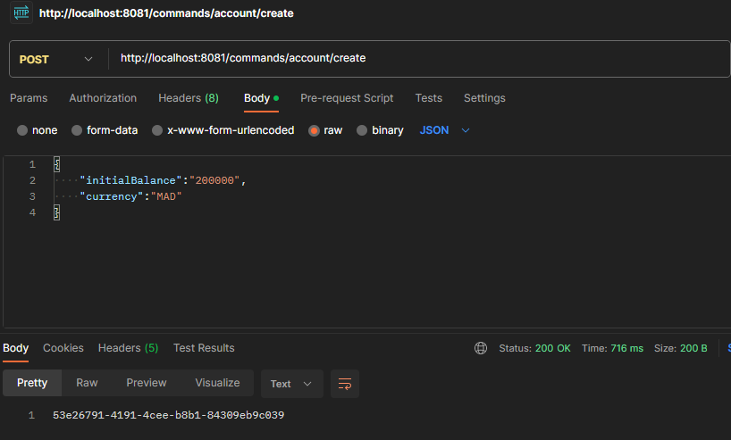
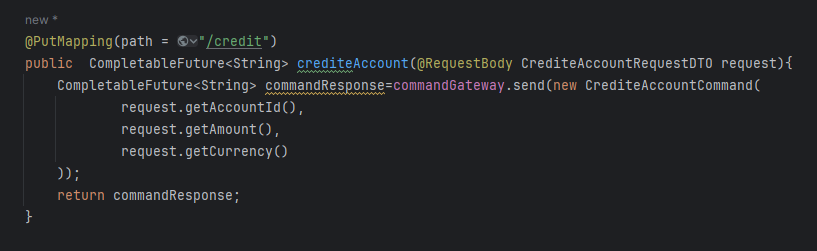
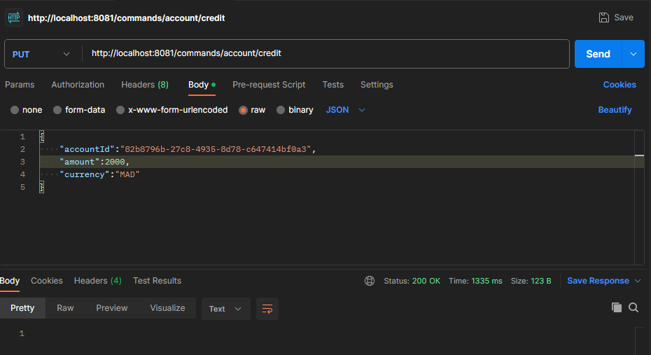

# compte-cqrs-es
Objectif : Créer une application de gestion de comptes utilisant les patterns CQRS et Event Sourcing, 
implémentée avec les Frameworks AXON et Spring Boot.

1. La creation du compte : 

Test :

2. Operation de vierement :

Test :

